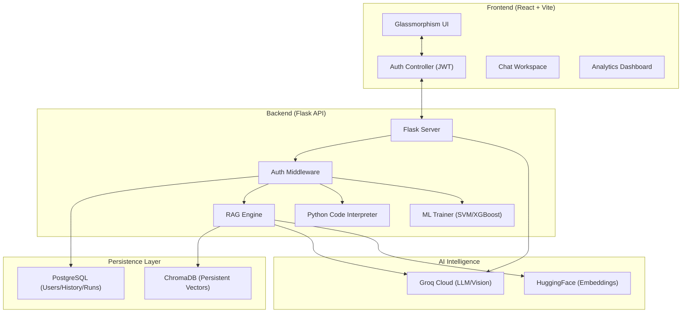
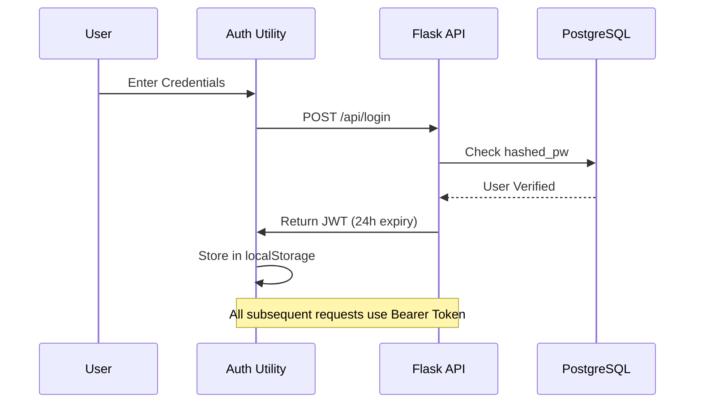
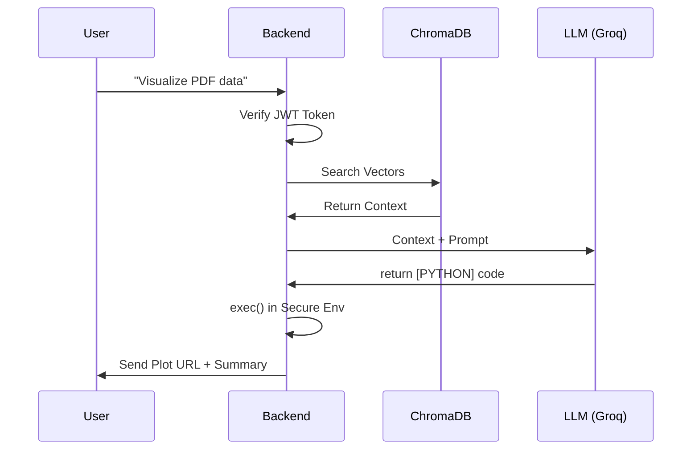

# 🤖 AI Analyst: Document Q&A & ML Dashboard

<div align="center">
  
  
  
  
  
  
</div>

---

## 🎨 Overview
**AI Analyst** is a high-performance, full-stack application that transforms static PDF documents into interactive intelligence. Built with a **Glassmorphism design system**, it offers a premium user experience for chatting with documents, performing visual data analysis, and monitoring ML model performance.

> [!IMPORTANT]
> This project implements a full **RAG (Retrieval-Augmented Generation)** pipeline with an integrated **Code Interpreter** for real-time data science visualizations.

---

## 🚀 Key Features

### 1. 📊 AI Data Analyst (Code Interpreter)
- **Visual Analytics**: Automatically extracts numerical data from PDFs and generates professional plots (Bar, Pie, Line) using `Matplotlib` and `Seaborn`.
- **In-Chat Rendering**: Data visualizations appear instantly within the chat interface.
- **File Exports**: Generate and download `CSV` or `Excel` datasets on-the-fly from document tables.

### 2. 🧠 Retrieval Augmented Generation (RAG)
- **Vector Intelligence**: Uses `HuggingFace` embeddings and `ChromaDB` for sub-second retrieval.
- **Context-Aware Chat**: Advanced prompting ensures the AI stays grounded in your specific documents.
- **Persistent Knowledge**: Embeddings are stored locally, so you don't need to re-upload files after restarts.

### 3. 📈 ML Analytics Dashboard
- **Performance Benchmarking**: Compares `SVM` and `XGBoost` model performance across your document set.
- **Live Metrics**: Monitors accuracy, F1-scores, and sample distributions via `Recharts` visualizations.
- **Document Tracking**: Real-time management of uploaded knowledge bases.

### 5. 🔐 Secure Access
- **JWT Authentication**: Full user registration and login system.
- **Protected API**: All data-sensitive endpoints are secured with Bearer tokens.
- **Session Management**: Persistent sessions with local storage integration.

---

### 4. 👁️ Vision & Voice
- **Multi-Modal**: Analyze images and screenshots using Groq's Vision models.
- **Interactive Audio**: Full **Text-to-Speech (TTS)** support for an eyes-free experience.

---

## 📊 ML Performance Benchmarks

Based on our latest evaluation with a sample set of **64 document chunks** across **3 document classes**:

| Model | Accuracy | F1-Score | Cross-Val Mean | Note |
| :--- | :--- | :--- | :--- | :--- |
| **SVM (RBF Kernel)** | **100.0%** | **1.00** | 95.4% | Outstanding for text embeddings |
| **XGBoost** | 84.6% | 0.81 | 89.1% | High-performance ensemble |

> [!TIP]
> **SVM** currently outperforms XGBoost in our specific text classification tasks due to its effectiveness in high-dimensional vector spaces created by `all-MiniLM-L6-v2`.

---

## 🏗️ System Architecture



---

## 🔄 Project Flows

### 1. Security & Authentication Flow


### 2. RAG + Code Execution Flow


---

## 🛠️ Technical Stack

| Category | Technology |
| :--- | :--- |
| **Frontend** | React 19, Vite, Tailwind CSS (Glassmorphism), Lucide-React, Recharts |
| **Backend** | Python 3, Flask, threading (Async tasks) |
| **Database** | PostgreSQL (Relational), ChromaDB (Vector) |
| **AI/ML** | LangChain, Groq API, HuggingFace Sentence-Transformers, Scikit-Learn, XGBoost |
| **Data Science** | Pandas, Numpy, Matplotlib, Seaborn, Openpyxl |

---

## 📦 Project Structure

```text
├── backend/
│   ├── app.py            # Main API & Routing
│   ├── db.py             # PostgreSQL Manager
│   ├── trainer.py        # ML Training Pipeline
│   ├── uploads/          # PDF Knowledge Base
│   ├── exports/          # Generated Plots & CSVs
│   └── venv/             # Python Virtual Environment
└── frontend/
    ├── src/
    │   ├── pages/        # ChatWorkspace, Dashboard, Home
    │   ├── App.jsx       # Routing & Framework
    │   └── index.css     # Design System & Glassmorphism
    └── vite.config.js
```

---

## 🛠️ Setup & Installation

### 1. Backend Setup
```bash
cd backend
python3 -m venv venv
source venv/bin/activate
pip install -r requirements.txt
python3 app.py
```
*Note: Ensure PostgreSQL is running and your `.env` contains `GROQ_API_KEY`.*

### 2. Frontend Setup
```bash
cd frontend
npm install
npm run dev
```

---

<div align="center">
  <p>Built with ❤️ by the AI Development Team</p>
  <p><i>Empowering users with actionable document intelligence.</i></p>
</div>
